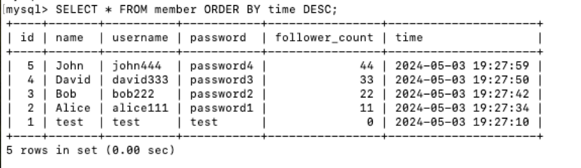
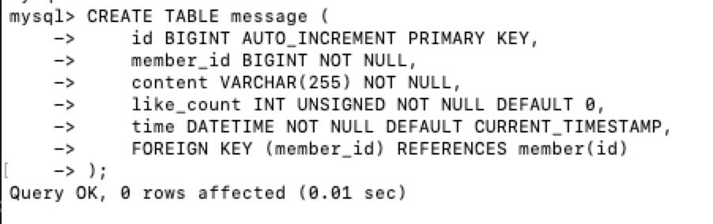

# Task 2

## [1] Create a new database named website.

CREATE DATABASE website;

## [2] Create a new table named member, in the website database

USE website;

CREATE TABLE member (
    id BIGINT AUTO_INCREMENT PRIMARY KEY,
    name VARCHAR(255) NOT NULL,
    username VARCHAR(255) NOT NULL,
    password VARCHAR(255) NOT NULL,
    follower_count INT UNSIGNED NOT NULL DEFAULT 0,
    time DATETIME NOT NULL DEFAULT CURRENT_TIMESTAMP
);

# Task3

## [1] INSERT a new row to the member table where name, username and password must be set to test. INSERT additional 4 rows with arbitrary data.

INSERT INTO member (name, username, password) VALUES ('test', 'test', 'test');

INSERT INTO member (name, username, password, follower_count) VALUES ('Alice', 'alice111', 'password1', '11');

INSERT INTO member (name, username, password, follower_count) VALUES ('Bob', 'bob222', 'password2', '22');

INSERT INTO member (name, username, password, follower_count) VALUES ('David', 'david333', 'password3', '33');

INSERT INTO member (name, username, password, follower_count) VALUES ('John', 'john444', 'password4', '44');

## [2] SELECT all rows from the member table.

SELECT * FROM member;

## [3] SELECT all rows from the member table, in descending order of time.

SELECT * FROM member ORDER BY time DESC;

## [4]SELECT total 3 rows, second to fourth, from the member table, in descending order of time. Note: it does not mean SELECT rows where id are 2, 3, or 4.

SELECT * FROM member ORDER BY time DESC LIMIT 1, 3;

## [5] SELECT rows where username equals to test.

SELECT * FROM member WHERE username = ‘test';

## [6] SELECT rows where name includes the es keyword.

SELECT * FROM member WHERE name LIKE ‘%es%';

## [7] SELECT rows where both username and password equal to test.

SELECT * FROM member WHERE username = 'test' AND password = 'test';

## [8] UPDATE data in name column to test2 where username equals to test.

UPDATE member SET name = 'test2' WHERE username = 'test';

# Task4

## [1] SELECT how many rows from the member table.

SELECT COUNT(*) AS total_members FROM member;

## [2] SELECT the sum of follower_count of all the rows from the member table.

SELECT SUM(follower_count) AS total_followers FROM member;

## [3] SELECT the average of follower_count of all the rows from the member table.

SELECT AVG(follower_count) AS average_followers FROM member;

## [4] SELECT the average of follower_count of the first 2 rows, in descending order of follower_count, from the member table.

SELECT AVG(follower_count) AS average_top2_followers FROM ( SELECT follower_count FROM member ORDER BY follower_count DESC LIMIT 2 ) AS top2;

# Task5

## [1] Create a new table named message, in the website database.

USE website;

CREATE TABLE message (
    id BIGINT AUTO_INCREMENT PRIMARY KEY,
    member_id BIGINT NOT NULL, 
    content VARCHAR(255) NOT NULL,
    like_count INT UNSIGNED NOT NULL DEFAULT 0,
    time DATETIME NOT NULL DEFAULT CURRENT_TIMESTAMP,
    FOREIGN KEY (member_id) REFERENCES member(id) 
);

## [2] SELECT all messages, including sender names. We have to JOIN the member table to get that.

SELECT m.name, msg.content
FROM member m
JOIN message msg ON m.id = msg.member_id;

## [3] SELECT all messages, including sender names, where sender username equals to test. We have to JOIN the member table to filter and get that.

SELECT m.name, msg.content
FROM member m
JOIN message msg ON m.id = msg.member_id
WHERE m.username = ‘test';

## [4] Use SELECT, SQL Aggregation Functions with JOIN statement, get the average like count of messages where sender username equals to test.

SELECT AVG(msg.like_count) AS average_followers 
FROM member m
JOIN message msg ON m.id = msg.member_id
WHERE m.username = ‘test’;

## [5] Use SELECT, SQL Aggregation Functions with JOIN statement, get the average like count of messages GROUP BY sender username.

SELECT m.username, AVG(msg.like_count) AS average_likes
FROM member m
JOIN message msg ON m.id = msg.member_id
GROUP BY m.username;

